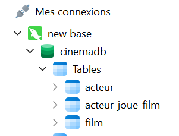
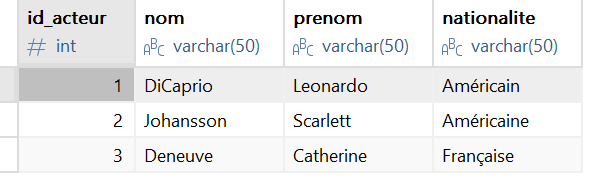
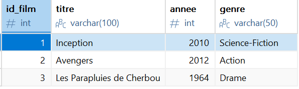
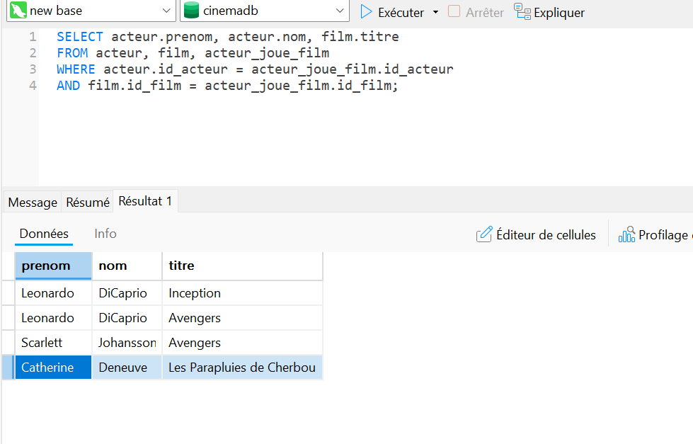

## 🗂 Structure de la base de données

Vue générale des tables dans Navicat :



## 👤 Table acteur

Exemple de contenu de la table acteur :



## 🎥 Table film

Exemple de contenu de la table film :



## 🔗 Jointure des tables

Requête SQL utilisée :

```sql
SELECT acteur.prenom, acteur.nom, film.titre
FROM acteur
JOIN acteur_joue_film ON acteur.id_acteur = acteur_joue_film.id_acteur
JOIN film ON film.id_film = acteur_joue_film.id_film;

```
## le resultat



## 🐍 Résultat Python

```markdown
## 🐍 Exploitation en Python

Résultat affiché après connexion à la base :

```
